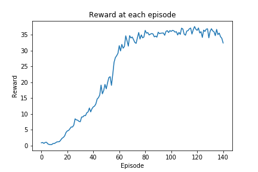

## Project 2: Continuous Control

Author: Abhijeet Biswas

### Project Goal

Train an agent to move its double-jointed arm to a goal location and keep it there.

### Project details

The environment is based on [Unity ML-agents](https://github.com/Unity-Technologies/ml-agents). 

The Unity Machine Learning Agents Toolkit (ML-Agents) is an open-source Unity plugin that enables games and simulations to serve as environments for training intelligent agents. 

In this environment, a double-jointed arm can move to target locations. A reward of +0.1 is provided for each step that the agent's hand is in the goal location. Thus, the goal of your agent is to maintain its position at the target location for as many time steps as possible. We have 20 such agents in this environment that get trained in parallel to share experiences and speed up learning.

The observation space consists of 33 variables corresponding to position, rotation, velocity, and angular velocities of the arm. Each action is a vector with four numbers, corresponding to torque applicable to two joints. Every entry in the action vector should be a number between -1 and 1.

The task is episodic, and in order to solve the environment, the agent must get an average score of +30 over 100 consecutive episodes.

### Learning Algorithm

I have implemented [Deep Deterministic Policy Gradient (DDPG)](https://arxiv.org/abs/1509.02971) in a parallel environment setting (20 agents)

source: [CONTINUOUS CONTROL WITH DEEP REINFORCEMENT LEARNING](https://arxiv.org/abs/1509.02971)

### CODE

The code is written in Python 3.6.3 and uses PyTorch 0.4.0. I have used detailed comments to explain all the steps.

### Network Architecture

- I have used  4  neural networks (Actor Main, Actor Target, Critic Main & Critic target), where each network has 4 layers.
- For Actors, there are 33(states), 128, 128 and 4(actions) neurons in each layer respectively.
- For Critic, there are 37 (states + actions), 128, 128 and 1 (Q value) neurons in each layer respectively.
- The first layer takes in the input which is states in case of Actor, and states & actions in case of Critic.The last layer outputs the action for Actor and Q value for critic respectively. Intermediate layers are used to build more complex features from input that will produce better results.
- I have used [ReLU](https://en.wikipedia.org/wiki/Rectifier_(neural_networks)) activation  and Dropout with 0.1 probability after each layer except the last one. For Actor, I have used tanh in the last layer to bound the actions between -1 and 1.

#### Other Hyperparameters

- tau: Used For soft update of target network, constant value of 1e-3 was used

- BUFFER_SIZE: Replay buffer  size of 1e6 was used

- BATCH_SIZE: Minibatch size of  512  was used

- UPDATE_EVERY: Episode Interval for network update, the network was updated after every 20 episodes     

- NUM_UPDATES: Number of passes over the data at each update step, 10 was used

### Results

The environment got solved in 141 episodes by having average reward (32.16) in more than 30 over 100 consecutive episodes. The below plot shows the reward received after each episode

### Future Ideas

1. Use prioritized replay buffer to replay important transitions more frequently, and therefore learn more efficiently.
2. Use [Distributed Distributional Deterministic Policy Gradients](https://openreview.net/pdf?id=SyZipzbCb) and [Proximal Policy Optimization](https://arxiv.org/abs/1707.06347) to compare performance against DDPG
